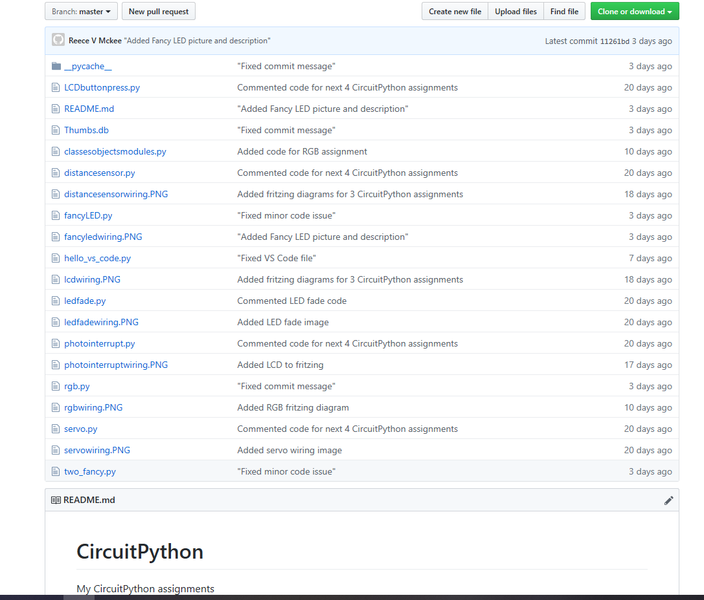
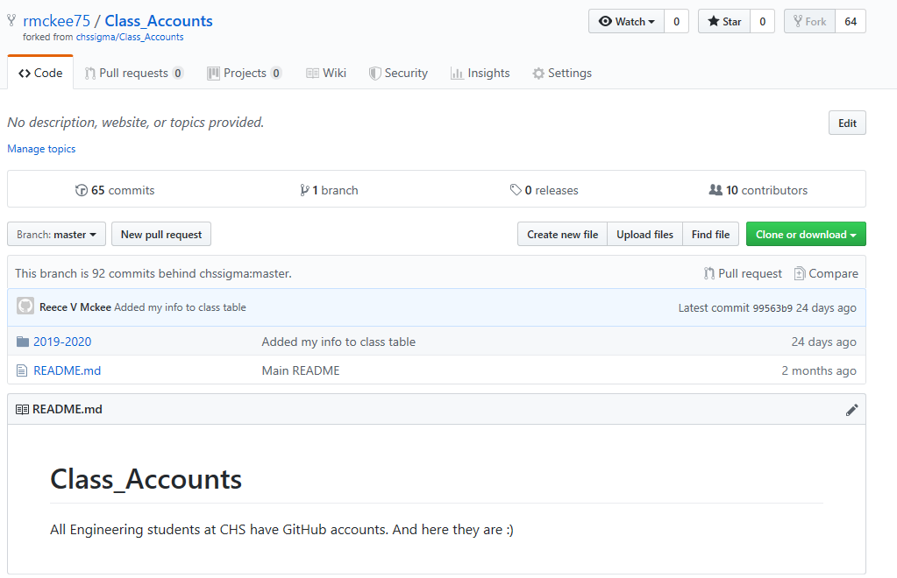

# Git and GitHub
My git assignments

## Hello Git
### Objective
Learn to use Git and set up a Git repository with CircuitPython assignments.
### Picture

### Lessons & Methods
In this assignment, I downloaded Git, created a Git repository called CircuitPython, used the "git add" and "git commit" functions to move my assignments to the repo, then created a README.

## Hello GitHub
### Objective
Create a GitHub account and push the CircuitPython repository to this online service.
### Picture

### Lessons & Methods
In this assignment, I learned how to link a repo to GitHub by using "git remote" and "git push origin (on GitHub) master (local repo)"

## Git - Forks and Clones
### Objective
Fork a copy of the CHS Sigma Class Accounts so that you can collaborate with other students.
### Picture

### Lessons & Methods
In this assignment I created a personal copy of the ClassAccounts page on GitHub (fork), then made a local copy of that repo (clone).  To get your newly added info onto the main ClassAccounts page, you need to wait for the owner (Dr. Shields) to accept your pull request.
