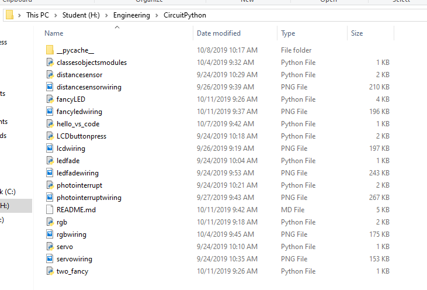

# Git and GitHub
My git assignments

## Hello Git
### Objective
Learn to use git and set up a git repository with CircuitPython assignments
### Picture

### Lessons and Methods
In this assignment, I downloaded git, created a git repository called CircuitPython, used the git add and git commit functions to move my assignments to the repo, then created a README.

